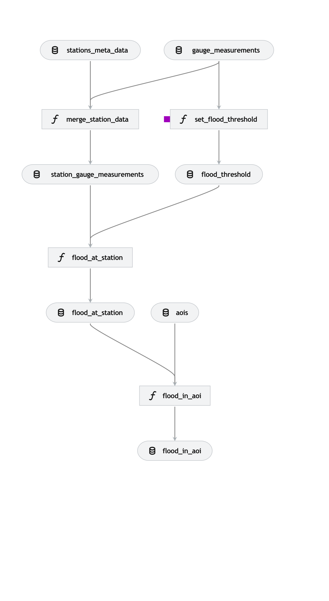

# iceye-takehome

## Getting started

I love using `uv` for managing python venv's.

>pip install uv

inside the parent directory where the `pyproject.toml` is located type:

> uv sync

then activate your venv using:

>  source .venv/bin/activate  

The data included in this exercise (`gauge_measurements.gpkg`, `exercise_aois.geojson` and `stations_exercise.gpkg`) should live under `data/01_raw/`. 

To generate a flood report for the AOIs (saved as a geojson) and set the flood threshold run:

> kedro run

The flood threshold values are written to `./data/02_intermediate` . A geojson file with the AOIs that contain flooded hydrological stations including the timestamps of the flood event are written to: `./data/08_reporting/flood_in_aoi.geojson`

A flood report (as a geojson) for all stations (also outside AOI) is also written to `./data/08_reporting/flood_at_station.geojson`. A boolean (named `flood_alert`) is included that indicates if a flood alert was triggered for that respective station at a particular time.

## Task 1: Implement a Gauge Flood Alert

Since all hydrological stations provide absolute water levels, I decided to use these measurements to analyse flood events. However, I was not able to find any flood warning level indicators (i.e. no flood, minor flood, moderate or major flood) in the datasets (as was described in the task). In the absence of additional data, I had to make several assumptions:

- Gauge measurements from 01/08/2024 - 25/09/2024 (start of heavy rains preceding land fall of hurricane Helene) can be used to establish baseline water levels per station. Here I used the mean of the gauge measurements to set the baseline. 

- A flood happens when the water level is 1 standard deviation above the baseline. The baseline and flood threshold level are calculated for every station.

The processing pipeline handles missing data (i.e. gauge measurements with NaN values will not trigger flood alerts). 

Flood alerts were detected for AOI `18628` and `19014` for time period 01/08/2024 - 10/10/2024. The identified flooded stations are: `02326050`, `MTSF1` and `02323500`. Below the water levels for the 3 flooded stations in the AOIs. 

As can be seen in the plots, the water level exceeds the flood threshold several times during the ~ 2 month period, triggering a flood alert in this processing pipeline. 

Limitations using this approach:

- Baseline water level is determined statistically and can be skewed due to either droughts or heavy rain events during the baseline period (i.e. 01/08/2024 - 25/09/2024). This will results in biased flood alerts. If the baseline water level is too low (e.g., due to droughts during the baseline period), normal water levels might exceed the flood threshold, triggering unnecessary flood alerts. If the baseline water level is too high (e.g., due to heavy rain), actual flood events might not exceed the flood threshold, leading to missed alerts.

- I defined a flood event when the water level exceeds the mean baseline by 1 standard deviation. However, this is arbitrary and more supporting data is needed to define a flood event more accurately. However, the threshold level can be set in the pipeline by changing the number of standard deviations above the mean that constitutes a flood event. In `conf/base/parameters.yml`  change the parameter `sigma`.

## Task 2: Geospatial Data Integration and Analysis

**Question 2a. Explain how you would integrate DEM data with gauge data to enhance flood stage assessment.**

With a DEM we would have elevation measurements for each point in the raster. My approach:

- For every pixel in the DEM, find the nearest station and compare the elevation of the pixel against the absolute water level at the station. 
- If water level + offset > elevation, trigger flood alert for that pixel. Offset is meant to not trigger alerts with small increases in water level. 
- Repeat above procedure for every hourly gauge measurement 

**Question 2b. Identify potential uncertainties in this integration and describe strategies to mitigate them.**

In the method described above I would take the nearest gauge measurement for every DEM pixel. However, the nearest gauge measurement might not be representative of the water level at that respective DEM pixel since we are ignoring fine scale topographical features (like small rivers, watersheds) that might not be captured by the DEM. Also, hydrological stations are likely not distributed evenly across the area, resulting in locations that are far away from any station. 

To overcome these limitations you could:
- use high resolution DEM models
- increase the number of water level sampling points by supplementing the existing dataset with water level estimates obtained from remote sensing observations (optical and/or radar). Or include more "noisy" data sources like social media feeds to determine flood events.

**Question 2c. Outline a methodology for determining when levees or floodwalls are at risk of overflow, especially in urban areas.**

I would take a similair approach as described above. For every levee and floodwall, determine the closest water level measurement (or estimate) and check if water level > levee/floodwall flood threshold. 

This approach assumes thatthe geolocation and flood level threshold for the floodwalls and levees are available.

**Question 2d. Now that you have considered the geospatial context, would you change the gauge alert function in some way?**

If additional data and time would be available, i would change the flood alert pipeline as described above.

## Tasks 3: 

I have included a diagram of the current pipeline. 

The gauge measurements (i.e. `gauge_measurements` in the diagram) are currently read from the data file on disk using an implementation of a Kedro `AbstractDataset` (see `GeoPackageDataSet` under `/src/flood_alert/datasets/datasets.py`). The implementation can be changed to instead query an API for gauge data. However, the flow diagram would remain unchanged. 

## GenAI utilization

I mainly use LLMs (GPT-4o or Claude) as replacement for API documentation look ups and resolving errors. 

